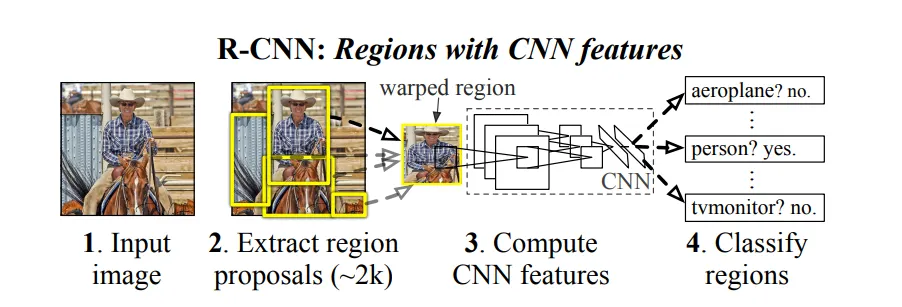
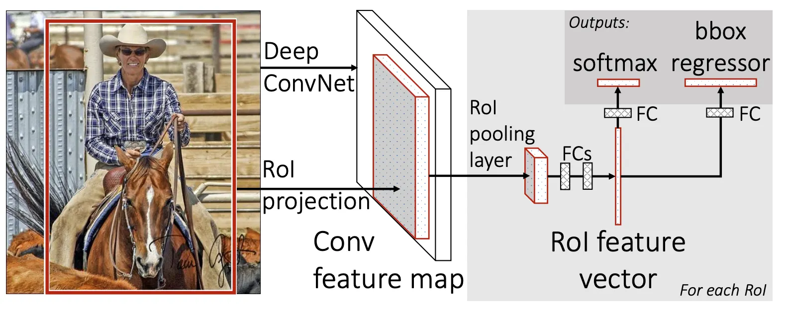
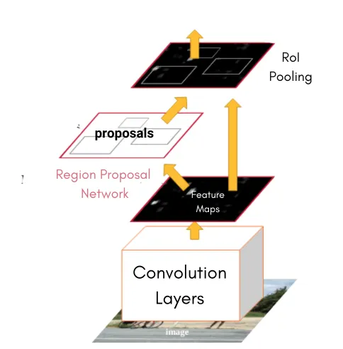
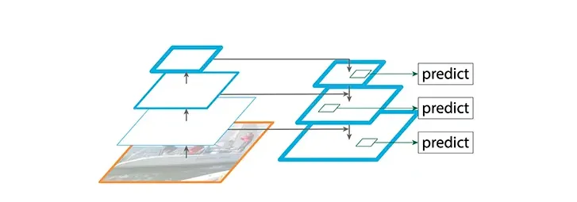
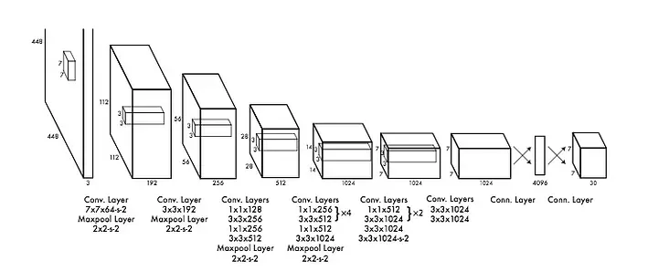
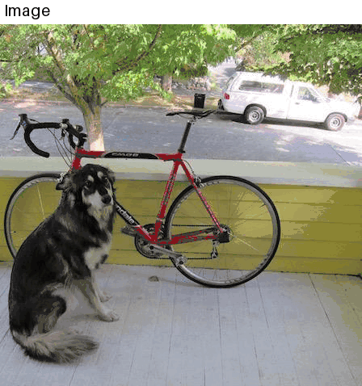

# FruitNinja AI
English version: [README.en.md](README.en.md).

Bot para **Fruit Ninja** treinado com poucas labels, baixo tempo de treinamento e alta precisão
A proposta do projeto é ser **reprodutível** e **treinável**: você consegue treinar seu próprio detector, exportar para ONNX e plugar no loop de gameplay com configurações claras (limites de idade da detecção, intervalo mínimo de ações, raio de segurança das bombas, overshoot do corte, etc.).

---

O modelo inicial foi treinado com 70 imagens durante 50 épocas, o que levou um tempo de 01:30 minutos. Ele conseguia distinguir perfeitamente entre frutas e bombas, mas acabou gerando muitos falsos positivos para pedaços de frutas, o que acabava ocoupando a fila dos cortes e diminuindo a eficiência do bot. Além de ter de usar um nível de confiança mais baixo devido a algumas frutas rotacionarem e o modelo ficar mais "confuso", exemplo da banana!
A segunda versão foi feita com 124 imagens e 80 épocas, o que possibilitou o aumento do grau de confiança e reduziu os casos de falso positivo, além de ter aprendido as rotações das frutas e até mesmo tendo generalizado para outros modos de jogos que continham as mesmas frutas mas com outras características (borda, efeitos, etc)
O terceiro modelo foi feito com 190 imagens e 120 épocas, que levou cerca de 5 minutos, o que trouxe as mesmas melhorias vistas no segundo modelo mas com maior precisão.

---
## Principais Recursos

- Detecção em tempo real e com baixa latência.
- Inferência com **ONNXRuntime** (boa portabilidade e performance).
- Controle de qualidade de ação:
  - **Filtro por idade da detecção**.
  - **Intervalo mínimo entre ações**.
- Heurísticas de corte:
  - **overshoot** baseado na diagonal do bbox.
  - correção por “segmento” para recheck de bomba.
- Heurísticas anti-bomba:
  - “safe zone” baseada na diagonal do bbox da bomba.
  - recheck instantâneo em regiões críticas.
- Diagnóstico opcional: logs e overlay (se habilitado).

---

## Como funciona em termos teóricos

Ele funciona em um loop principal que segue a seguinte ideia:
1. **Captura** um recorte da janela do jogo.
2. **Pré-processa** fazendo letterbox/resize mantendo proporção.
3. **Roda inferência** no modelo.
4. **Pós-processa**:
   - converte para bboxes na escala original
   - separa frutas e bombas por classe
   - aplica limiares de confiança.
5. **Decide ação**:
   - ignora detecções antigas
   - escolhe alvos de fruta (prioridade por confiança/área/posição),
   - calcula o traçado do corte
   - valida segurança contra bombas (safe zone + rechecks)
6. **Executa o corte** via controlador

## Execução do bot

Crie um ambiente conda ou ative um já existente:
```bash
# criar ambiente no cmd
conda env create -f environment.yml
# ativar ambiente
conda activate "nome_do_ambiente"
```

Após ativar o ambiente instale as dependências
```bash
pip install .
pip install -r requirements.txt
```

Abra através do launcher da Play Store (Google Play Games) o jogo Fruit Ninja
Recomendo que reduza a qualidade dele nas configurações do próprio launcher e também reduza o tamanho da janela, aumentando o desempenho do modelo e da inferência.

Após execute via cmd com o ambiente ativo:
```bash
fruitnai-bot
```

Ou execute diretamente pelo módulo:
Inferência padrão (sem debug/logs):

```bash
python -m bot.run
```

Com diagnósticos (draw/debug/logs):

```bash
python -m bot.run --enable-diagnostics
```
## Configurações úteis (tuning)

Os principais parâmetros ficam no `src/bot/run.py` logo no início, com valores padrão ajustados para:

- **Detecção/tempo**
  - `MAX_DET_AGE_S`: idade máxima da detecção (evita cortar no passado)
  - `MIN_ACTION_INTERVAL_S`: intervalo mínimo entre cortes
  - `RECENT_TTL_S` / `RECENT_RADIUS_PX`: bloqueio temporário de região
- **Inferência**
  - `PREDICT_IMGSZ`: tamanho da imagem para o modelo
  - `MIN_FRUIT_CONF` / `MIN_FRUIT_AREA`: filtro por confiança/área
- **Heurísticas de corte**
  - `OVERSHOOT_BASE_PX` / `OVERSHOOT_DIAG_FACTOR`: overshoot do slice
  - `SEGMENT_OFFSET_PX`: offset para recheck instantâneo
- **Heurísticas anti-bomba**
  - `BOMB_SAFE_BASE_PX` / `BOMB_SAFE_DIAG_FACTOR`: safe zone
  - `INSTANT_SAFE_BASE_PX`: raio do recheck

Se quiser trocar o modelo ONNX, ajuste o caminho:

- `ONNX_PATH = "models/runs/fruitninja_yolo11n3/weights/best.onnx"`

---


## Teoria 
Hoje um desafio que está muitas vezes no SOTA (State of Art) do Machine Learning é o tamanho massivo dos modelos, que gera um alto tempo e custo de treinamento.
O projeto busca fazer o fine-tunning de um modelo pré-treinado a fim de fazer uma adaptação de domínio para o jogo.

**Fine-Tunning** é um processo que faz parte do **Transfer Learning**, ele consiste em pegar um modelo já criado por alguém, remover/treinar as últimas camadas dele que são as responsáveis pelo classificação ou outras taks.
Algumas técnicas podem ser aplicadas para um melhor tunning, como a aplicação de **data augmentation**, que consiste na transformação das imagens dentro do dataset a fim de garantir uma maior variedade nas imagens, isso garente com que mesmo com poucas imagens elas não serão sempre da mesma forma, fazendo com que o modelo não faça apenas o overfitting, mas sim aprenda as features da task.

Também existem outras diversas técnicas possíveis para o treinamento de modelos, como a adição de layer convolucionais, a concatenação de layers, etc.

### Escolha do modelo base (YOLO)
Ele tem como foco a identificação de objetos, então além de categorizar ele também passa as coordendas.
Para chegarmos na lógica do YOLO precisamos passar por algumas outras arquiteturas de redes primeiro.
RCNN: usa Selective Search para selecionar uma região e depois passa para uma CNN classificar o objeto da região!
  

Após isso vem o Fas RCNN que pega o modelo anterior e o treina em um único estágio ao invés de varios, fazendo o ROI pooling.
  

Após isso vem o Faster RCNN que remove a necessidade do Selective Search, o que aumenta o tempo de inferência. Introduz o **RPN** (Regional Proposal Network) que é um modelo baseado em atenção.
  

Após isso vem o **FPN** (Feature Pyramid Network) que é um tipo de Inception Model, ele faz um downscale da imagem para embeddings de dimensões menores, depois faz o upscale novamente e com ele tenta fazer a previsão.
  

**TODAS AS IMAGENS FORAM RETIRADAS DO HUGGING FACE**  

Agora podemos de fato falar do YOLO!
YOLO é um detector de objetos em tempo real com uma única rede! Antes dele os modelos consistiam em classificadores de imagens que faziam em pedaços de uma imagem ao invés de toda ela. Isso fazia com que os pipelines fossem lentos, devido a quantidade de componentes individuais que precisam ser treinados.

Já o YOLO é um detector de passo único, onde a caixa delimitadora e a classe do objeto é prevista em um único passo, e isso torna ele super rápido.

Ele começa dividindo a imagem por SxS grids. E B é a quantidade de objetos que podem ser detectados em cada célula. Cada célula é uma caixa delimitadora. O grid que ficar no centro do objeto será o responsável por detectar o objeto. Para verificar se a caixa foi corretamente prevista é calculado uma pontuação de confiança. Que usa a Intercessão Sobre União (IOU) da caixa verdadeiro vs a predita.
As coordenadas são trazidas em 4 número (x, y , w, h) e x e y são as coordenadas que representam o centro da caixa. w e h são as dimensões.

Em questão da rede é uma simples rede conv inspirada no GoogLeNet que usa conv 1x1 para reduzir a profundida do feature map. A função de ativação é o LeakyReLU e para o layer final é o Linear
  

Por fim recebemos diversos bboxes e aplicamos um score para manter apenas aquelas com o maior nível de confiança! O processo do YOLO pode ser visto no GIF abaixo.  

  

Por fim como estamos usando o YOLOv8 trouxe um resumo bem por cima das melhorias que foram ocorrendo até chegar nessa versão:

- v2: trocou a arquitetura backbone para a Darknet-19 que usa 19 conv layers e aplicou batch normalization. Também introduziu o conceito de anchor boxes, que é ao invés de prever algumas caixas por célula de forma livre é prever o número determinado de âncora que possuí largura e alturas típicas, no caso aqui foi 5 em um grid de 13x13, ficando 13x13x5 = 845 boxes.
- v3: Troca para o Darknet-53. Usa também 3 diferentes escalas para o grid (13x13, 26x26, 52x52) o que aumenta o número de boxes (13x13x3 + 26x26x3 + 52x52x3 = 10.647)
- v4: Troca para CSPDarknet53 que aumenta a eficiência no uso de recursos. Também incluí  uma série de aumentos antes do treinamento que generalizam melhor o modelo, junto com algo chamado de bag-of-freebies que é um método de otimização.
- v5: foi escrito em C que deixa mais rápido e também adicionado o auto-anchors, que usa o knn para pegar as melhores âncoras e forma automática e adaptar o modelo.
- v6: faz reparametrização com o RepVGG que é o conceito de fusão de branchs para otimização/representação. Também foi feito a introdução de novas funções de perda (arifocal Loss para clasificação, IOU Series Loss para as caixas e Distribution focal)
- v7: nova versão para o bag-of-freebies que incluem um novo método de atribuição de labels que leva o nome de coarse-to-fine lead-guided que usa fluxos da propagação do gradiente para analizar como reparametrizar a convolução. Também propoz “extend” e “compound scaling” metódos para a detecção de objetos.
- v8: mexeu na arquitetura e fez uma abordagem livre de âncoras.

## Treinando seu prório modelo
O repositório tem um pipeline simples para construir dataset e treinar:

1. **Indexação de dataset**
   - `src/indexer.py` cria o `dataset_index.jsonl` a partir de imagens + labels.
2. **Construção do dataset Ultralytics**
   - `src/ultralytics_builder.py` transforma o manifest em `data.yaml`.
3. **Treinamento/Export**
   - Os notebooks em `notebooks/` estão numerados na ordem de execução.
   - Lá você encontra também passos de **export para ONNX**.
4. **Extra**
   - Caso você queira ver uma implementação de treinamento e aplicação de técnicas um pouco mais hardcoded basta ir no notebook  `extra_train_manual`, onde eu fiz o treinamento de mais um modelo na "unha" usando a lib **transformers** do HF.
   

> Dica: mantenha o formato YOLO (`class_id x_center y_center w h`) para as labels.

### Passo a passo
1. Grave um vídeo do jogo com um gravador qualquer.
2. Gere frames desse vídeo
    - Recomendo fazer com ffmpeg
    ```bash
    # obtém onde está a os pixels do jogo no vídeo
    ffmpeg -i "seu_video.algumacoisa" -vf "cropdetect=24:16:0" -t 10 -f null -
    # gera frames de acordo com o crop
    ffmpeg -i "seu_video.algumacoisa" -vf "crop=w:h:x:y,fps=5" -q:v 2 "frames/frame_%06d.jpg"
    ```
3. Faça o label das imagens
    - LabelImg ou qualquer outra do seu gosto
    - Ao menos 2 classes (Fruit, Bomb)
    - Colocar imagens com apenas Background
    - Colocar imagens com diversos pedaços de frutas cortadas (evitar falso positivo)
4. Após isso bastar seguir os arquivos dentro de `notebooks/` e adaptando conforme suas preferências
5. Depois de salvar seu modelo **ONNX** você entre em `src/bot/run.py` e edita o `ONNX_PATH`